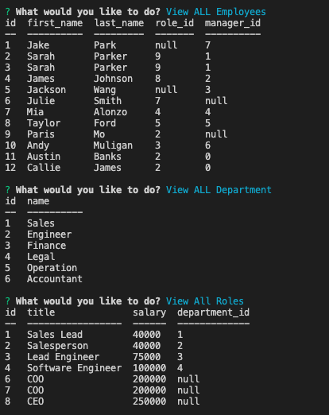

# Employee-Tracker

## Summary

[Video Demo](https://youtu.be/SUfSYc_hoAs)

Emplyee Tracker is an app for businesses to be able to view department, roles, emoloyees. In addition, you can also update roles and add departments, roles, and employees. In order to build a solution for this app dependencies used were

 * MySQL
 * Inquirer

The order of the creating the app was desiging the schema database into three tables 

Following MySQL, the next step was to build a command-line application for each category 

### Created By
Gina Vargas

   [GitHub](https://github.com/ginavargas1)

   [LinkedIn](www.linkedin.com/in/ginavargas89)

